# ANNOTATIONS USING CVAT (GUIDE)

## Website and user login

* The annotations tool and tasks are available at the website [http://label.plyzer.ai/](http://label.plyzer.ai/). CVAT must be accessed using the **Google Chrome Browser**. Any other browser is not supported.

* Lahore user login credentials
	* 	**Username:** `lahore`
	*  The **password** will be given via Slack chat

> **Note:** You will be working in parallel with the same user. Since labeling work is not saved and updated in real time for other login sessions, you must distribute and assign tasks or even images in a task between every person performing annotations. This way, you won't label the same image twice. In order for the labeling work done in parallel to appear to the other sessions you must **save the work and reload the page**.

## Introduction

The images used for annotations have been automatically rectified to recover the parallelism between lines and therefore remove the projection distorsion. Bounding-boxes are pre-computed using a deep learning model (SKU110K) and labeled as **UNANOTATED_OBJECT** since the model can not predict the product label yet. 

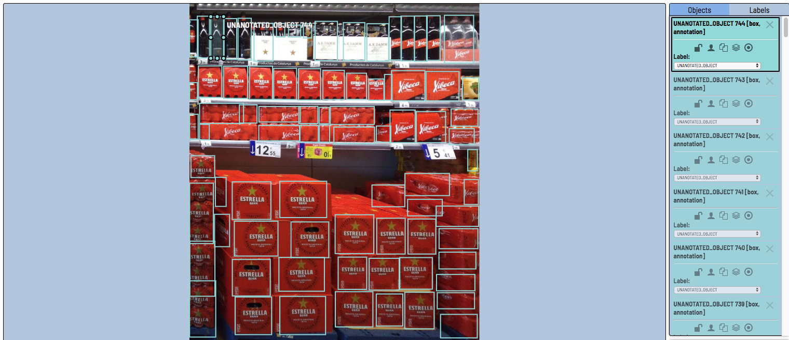

The model computes bounding-boxes for each product it can see indepently of its trademark. This means that **products that must not be labeled may have a bounding-box** and vice versa, **some products that must be labeled may not have a bounding-box**. We are interested on DAMM group products. Following there is a list of the trademarks we are going to be working with. An example picture of products is provided, but this does not mean that just the listed products are going to appear on the datasset, there will be new products of the same trademarks and some given examples may never appear.

The official CVAT user guide is available [here](https://github.com/opencv/cvat/blob/develop/cvat/apps/documentation/user_guide.md). Our instructions and use case guide is the following:

## Focus trademarks

1. Estrella Damm [`can`](https://cdn.plyzer.com/img/products/100650.jpg) [`bottle`](https://cdn.plyzer.com/img/products/100660.jpg) [`can pack`](https://cdn.plyzer.com/img/products/100652.jpg) [`bottle pack`](https://cdn.plyzer.com/img/products/100658.jpg)
1. Free Damm [`can`](https://cdn.plyzer.com/img/products/100582.jpg) [`can pack`](https://cdn.plyzer.com/img/products/100583.jpg) [`bottle pack`](https://cdn.plyzer.com/img/products/100584.jpg)
2. Free Damm Lemon [`can`](https://cdn.plyzer.com/img/products/100585.jpg) [`can pack`](https://cdn.plyzer.com/img/products/100586.jpg)
1. Voll Damm [`can`](https://cdn.plyzer.com/img/products/100782.jpg) [`bottle`](https://cdn.plyzer.com/img/products/100615.jpg) [`can pack`](https://cdn.plyzer.com/img/products/100610.jpg) [`bottle pack`](https://cdn.plyzer.com/img/products/100613.jpg)
1. Xibeca [`can`](https://cdn.plyzer.com/img/products/100618.jpg) [`bottle`](https://cdn.plyzer.com/img/products/100616.jpg) [`can pack`](https://cdn.plyzer.com/img/products/100619.jpg) [`bottle pack`](https://cdn.plyzer.com/img/products/100617.jpg)
1. Damm Lemon [`can`](https://cdn.plyzer.com/img/products/100575.jpg) [`bottle`](https://cdn.plyzer.com/img/products/100688.jpg) [`can pack`](https://cdn.plyzer.com/img/products/100687.jpg) [`bottle pack`](https://cdn.plyzer.com/img/products/100576.jpg)
1. Daura [`can`](https://cdn.plyzer.com/img/products/100577.jpg) [`bottle`](https://cdn.plyzer.com/img/products/100578.jpg) [`can pack`](https://cdn.plyzer.com/img/products/100780.jpg) [`bottle pack`](https://cdn.plyzer.com/img/products/100779.jpg)
2. Daura Marzen [`bottle`](https://cdn.plyzer.com/img/products/100580.jpg) [`bottle pack`](https://cdn.plyzer.com/img/products/100581.jpg)
1. Turia [`can`](https://cdn.plyzer.com/img/products/100600.jpg) [`can pack`](https://cdn.plyzer.com/img/products/100601.jpg)[`bottle pack`](https://cdn.plyzer.com/img/products/100602.jpg)
1. Complot [`bottle`](https://cdn.plyzer.com/img/products/100573.jpg) [`bottle pack`](https://cdn.plyzer.com/img/products/100574.jpg)
1. Innis & Gunn Blood red sky [`bottle`](https://www.amstein.ch/Htdocs/Images/Pictures/59139.jpg) [`pack`](https://images.heb.com/is/image/HEBGrocery/002204744-1?id=IRbSX0&fmt=jpg)
1. Malquerida [`bottle`](https://cdn.plyzer.com/img/products/100692.jpg) [`pack`](https://cdn.plyzer.com/img/products/100568.jpg)
1. AK Damm [`bottle`](https://cdn.plyzer.com/img/products/100569.jpg) [`pack`](https://cdn.plyzer.com/img/products/100570.jpg)
1. Inedit [`bottle`](https://cdn.plyzer.com/img/products/100587.jpg) [`pack`](https://cdn.plyzer.com/img/products/100588.jpg)
1. Bock Damm [`can`](https://cdn.plyzer.com/img/products/100571.jpg) [`bottle`](https://www.dammcorporate.com/sites/default/files/paragraph/product/bock-damm_1.png) [`pack`](https://cdn.plyzer.com/img/products/100572.jpg)
1. Sazz [`bottle`](https://img2.zakaz.ua/white-1001PXD.1348680921.ad72436478c_2012-10-03/white-1001PXD.1348680921.SND186F2.obj.0.6.jpg.oe.jpg.pf.jpg.1350nowm.jpg.1350x.jpg) [`pack`](http://www.lalistadelacompra.es/6338-large_default/-cerveza-saaz-damm-33cl-p-6.jpg)
1. Shofferhoffer [`can`](https://d3czfiwbzom72b.cloudfront.net/wp-content/uploads/2018/10/06445-SCHOFFERHOFER-GRAPEFRUIT-1-w.png) [`bottle`](https://media-verticommnetwork1.netdna-ssl.com/wines/12-x-schofferhofer-hefeweizen-wheat-50cl-1513861-s508.jpg) [`pack`](https://icdn.bottlenose.wine/images/full/424532.jpg)
1. Skol Shandy [`can`](https://cdn.plyzer.com/img/products/100598.jpg)
1. Skol [`can`](https://images-na.ssl-images-amazon.com/images/I/71VmUo7q0gL._SL1463_.jpg) [`bottle`](https://images-na.ssl-images-amazon.com/images/I/51fbR41rQVL._SX342_.jpg) [`pack`](https://images-na.ssl-images-amazon.com/images/I/81dppFPMt4L._SL1500_.jpg)
1. Skol Sin [`can`](https://cdn.plyzer.com/img/products/100599.jpg)
2. Estrella Levante [`can`](https://cdn.plyzer.com/img/products/100625.jpg) [`bottle`](https://cdn.plyzer.com/img/products/100623.jpg) [`can pack`](https://cdn.plyzer.com/img/products/100626.jpg) [`bottle pack`](https://cdn.plyzer.com/img/products/100628.jpg)
2. Estrella Levante sin [`can`](https://cdn.plyzer.com/img/products/100629.jpg) [`bottle`](https://www.proveedores.com/site/company/48/1843/images/108449/proveedores-estrella-sin-alcohol_crs2.jpg) [`bottle pack`](https://cdn.plyzer.com/img/products/100630.jpg)
3. Estrella Sur [`can`](https://cdn.plyzer.com/img/products/100637.jpg) [`bottle`](https://cdn.plyzer.com/img/products/100635.jpg) [`bottle pack`](https://cdn.plyzer.com/img/products/100638.jpg)
3. Estrella Sur sin [`can`](https://cdn.plyzer.com/img/products/100633.jpg) [`bottle`](https://cdn.plyzer.com/img/products/100631.jpg)[`bottle pack`](https://cdn.plyzer.com/img/products/100634.jpg)
4. Punta Este  [`bottle`](https://cdn.plyzer.com/img/products/100778.jpg)[`bottle pack`](https://cdn.plyzer.com/img/products/100649.jpg)
5. Victoria de Málaga [`can`](https://cdn.plyzer.com/img/products/100607.jpg) [`bottle`](https://cdn.plyzer.com/img/products/100605.jpg) [`can pack`](https://cdn.plyzer.com/img/products/100608.jpg) [`bottle pack`](https://cdn.plyzer.com/img/products/100609.jpg)
6. Oro Bilbao [`can`](https://sgfm.elcorteingles.es/SGFM/dctm/MEDIA03/201905/24/00118600302139____1__600x600.jpg) [`bottle`](https://www.oro.eus/sites/default/files/2017-04/botella-33.png) [`bottle pack`](https://cdn.plyzer.com/img/products/100648.jpg)
7. Keler [`can`](https://cdn.plyzer.com/img/products/100644.jpg) [`bottle`](https://cdn.plyzer.com/img/products/100640.jpg) [`can pack`](https://cdn.plyzer.com/img/products/100647.jpg) [`bottle pack`](https://cdn.plyzer.com/img/products/100642.jpg)
8. Verna [`can`](https://cdn.plyzer.com/img/products/100604.jpg) [`bottle`](https://www.dammcorporate.com/sites/default/files/paragraph/product/verna_1.png)
9. Radeberger [`bottle`](https://icdn.bottlenose.wine/images/full/395831.jpg)[`bottle pack`](https://cdn.plyzer.com/img/products/100590.jpg)

## Labeling process

In order to perform the image labeling while dealing with _false positives_ (products that should not be labeled) and _false negatives_ (products that should be labeled but are not) we propose the following method.

1. **Delete all bounding-boxes** of objects you are **100% sure they do not belong to DAMM products**. Here we list some popuar companies and their trademarks that **should not be labeled**:
    1. Heineken
        1. El Águila
        1. Desperados
    2. Coronita
    3. Cruzcampo
    4. Amstel
    5. Mahou
        5. Cervezas Alhambra
    6. Paulaner
    7. Erdinger
    8. Leffe
    9. Ambar
    10. Carlsberg
    11. Budweiser
    12. Guinness

    
    This can be done using the `Del` key (`Fn + Del` on Mac).

2. Label the remaining boxes with its corresponding product. The labeling is designed in the following way:
**`Trademark_PackageType_ProductType_NumberUnits_UnitVolume`**
    - **Trademark**: trademark of the product (one of the listed in the [first list](#damm_list))
    - **PackageType**: Either `SINGLE` (refering to single products as for example a bottle) or `PACK` (a pack of products e.g. bottle box)
    - **ProductType**: Either `BOT` (refering to bottles) or `LATA` (refering to cans, _LATA_ is the spanish for can).
    - **NumberUnits**: Can be `1UNIT` for single objects or `6UNIT`, `10UNIT`, `12UNIT` and `24UNIT` referencing the number of products found in a pack. In case of packs the number of products it contains should be written on the packaging or possible to be counted, if it's not possible to determine the number of units leave the product as an `UNANOTATED_OBJECT`.
    - **UnitVolume**: Defines the volume of the product. For the case of bottles the possible volumes are `25CL`, `33CL`, `66CL` and `1L`. Cans can be `33CL` or `50CL`. If it's not possible to determine the volume leave the product as an `UNANOTATED_OBJECT`.

   By clicking on the box you want to annotate the selected item will appear highlighted on top of the object list. The object label has to be chosen from the list shown under each object. 
   

   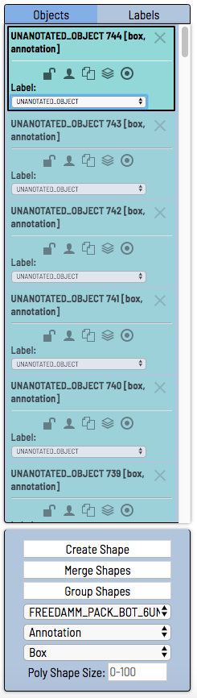

   
   Since there are a lot of labels and there are no possible keyboard shortcuts to assign to all of the labels. What can be done in order to speed up the labeling process when there are some objects with the same label is: 
   
   - Label one of those products. 
   

   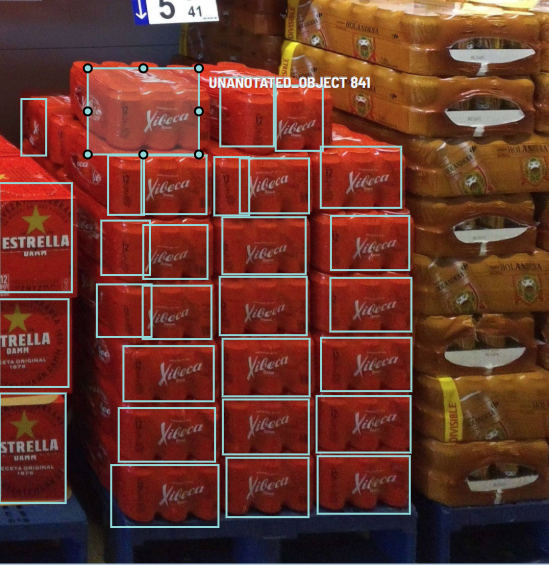
   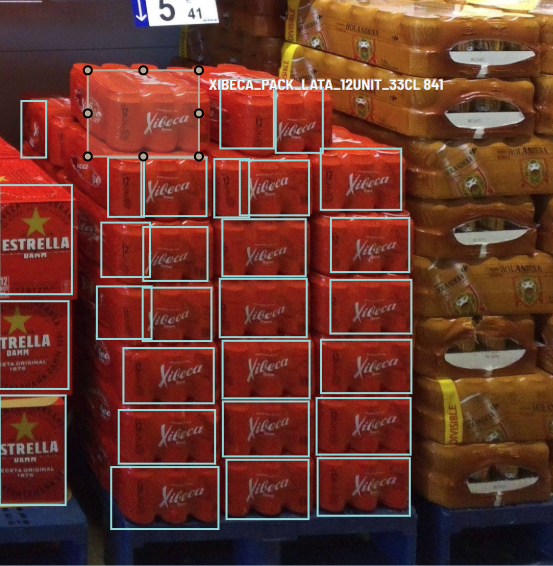

   - Delete the rest of the objects of the same product with the **UNANOTATED_OBJECT** label.
	

   
   
   - Copy (`Ctrl + C`) and paste (`Ctrl + V`) the labeled shape into the position of the other objects with the same label.
   

   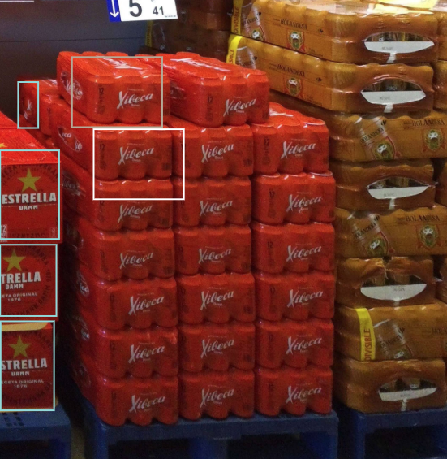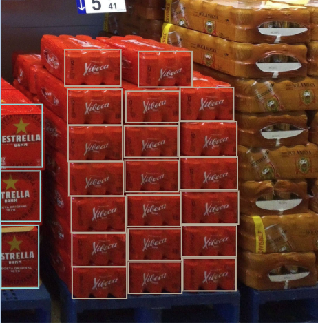
     

1. Adjust the boxes so **they outline the product with no remaining space** (i.e. there should be no remaining space at the top or the sides, and  the surface where the object sits shouldn't appear) and **just the frontal face of the product is inside the box**, this is meant to keep boxes rectangular, ignoring the sides of the product (e.g. in can-packs that are not seen from the front)

   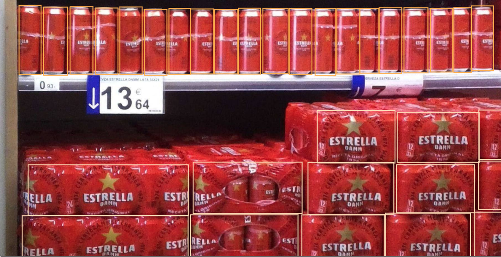
   
1. At the end of each image you can go to the `labels` tab and hide all the labels exept the **UNANOTATED_OBJECT** to check that you didn't leave any product unlabeled except for those that do not have their label available on CVAT.

   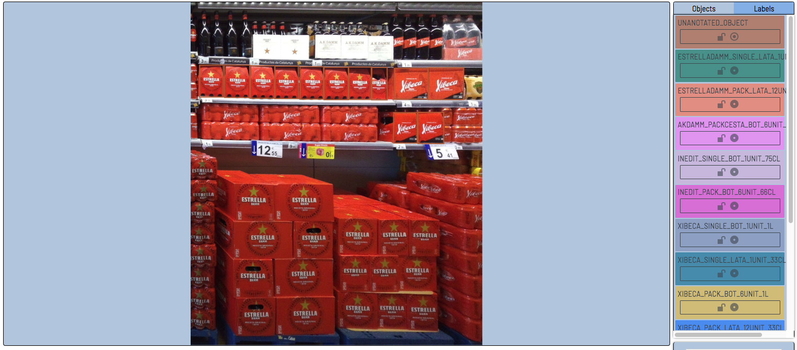

## **REMEMBER TO SAVE THE WORK ONCE IN A WHILE**

To store the annotations into the server work needs to be saved. **Everything that is not saved explicitly will not be kept for the next time you open the job and you will have to start over**.

   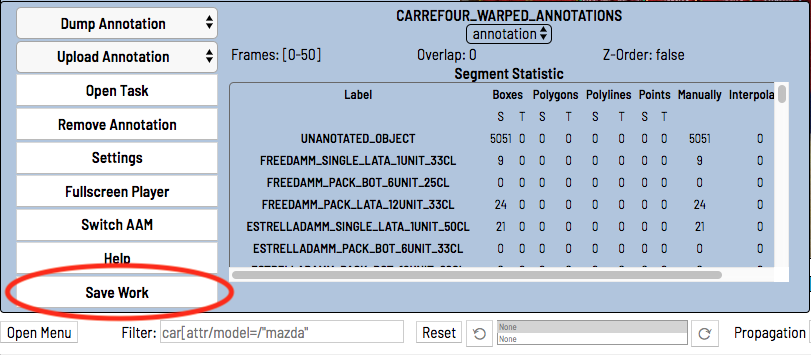

Save work button is into the Menu that can be accessed by the *Open Menu* button. 

### Other useful Menu options

The Menu also has a Help tab that will show you all the avaiable keyboard shortcuts. You may find something usefull there in addition to the shortcuts already explained in this file.

## Special cases
       
### Six can packs

Six can packs are obiosuly composed of individual cans tied together with some plastic rings. By the moment the detection/classification system is not able to detect a six can pack and it identifies each can individualy, therefore the classification will be performed on each separate can. This is why we must keep both labels, the six can pack label (e.g. `ESTRELLADAMM_PACK_LATA_6UNIT_33CL`) and the individual can label (`ESTRELLADAMM_SINGLE_LATA_1UNIT_33CL`). To do this a new shape must be created for the six pack label and then annotate it.

In order to work with both labels without them overlaping and not allowing you to work some labels can be hidden by pressing the circle next to each label in the `labels` tab. 
 

   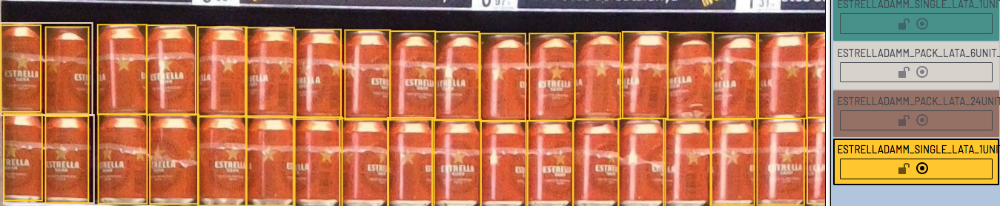
  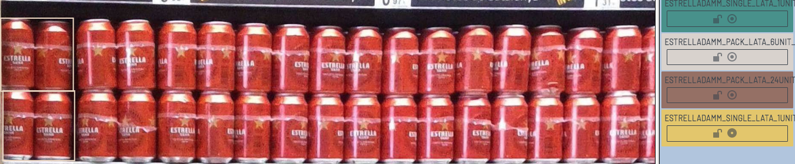
  

### Partially occluded objects

 The automatic projective correction and the nature of the images may cause some objects to be covered by others or not to be completely shown in the image. In order to deal with this situations CVAT offers the *occluded property* for any shape. This property is turned on/off for the bounding box under the cursor by pressing the `Q` key. We are only interested in occluded objects that can give any product classification information, other objects should be left unannotated. Objects croped due to the perspective correction (at the bottom or top of the image) should also be annotated as occluded. Basicaly any bounding box that is not the perfect case for that label should be annotated as occluded.
 

   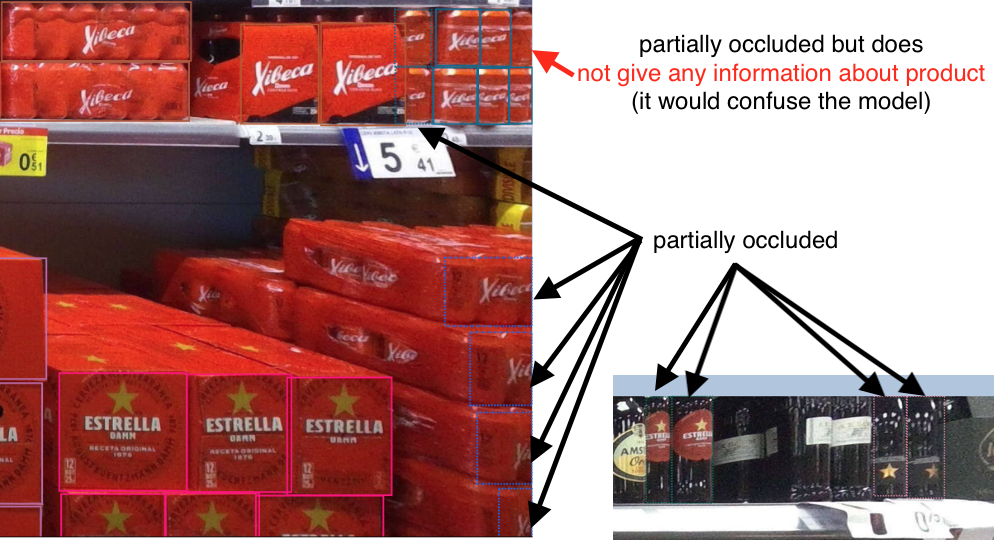

### Objects *deep* in the shelf

The goal of this model is intented to classify objects that are found on the front of the shelf, what is also called the _facing_. We are not interessed on those products found in the middle or the back of the shelf. This is why we will label just the ones at the front of the shelf, forgetting about the ones that can aso be seen but are not on the fron of the shelf, as it can be seen in the following image.

   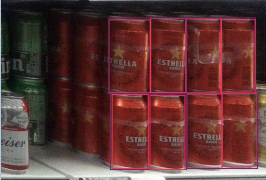 

    <em>Note how the cans seen at the back of the shelf are not labeled</em>

## Usage tips

### New annotations
New annotations can be created using `N` key. When in the *new annotation* mode you have to click at one corner of the box and then click again at the oposite corner. The created annotation will have the *default label* selected at the moment. This *default label* is the one that appears at the bottom right corner.

   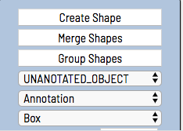

### Color by label

Colors shown on each object depend on the `Color by` atribute at the bottom of the page. This can be either `Instance` (each object with a different color), `Group` (each object group with a different color) or `Label` (objects with the same label have the same color). The `Color by label` option can be useful to better visualise the ongoing work and to see what elements are left to label.

   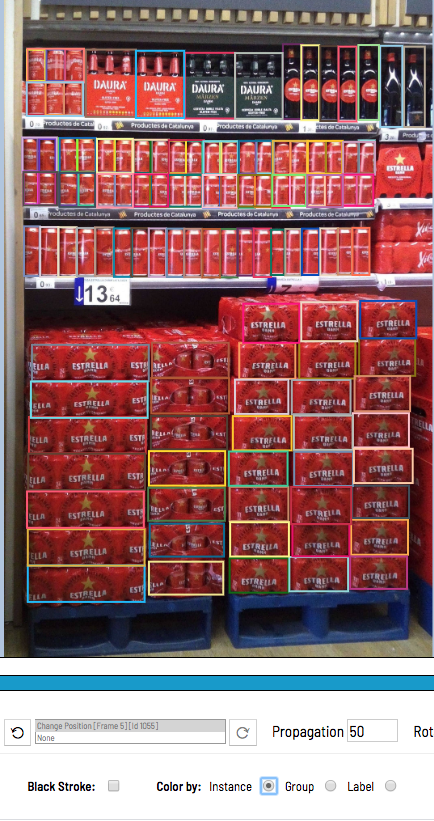
  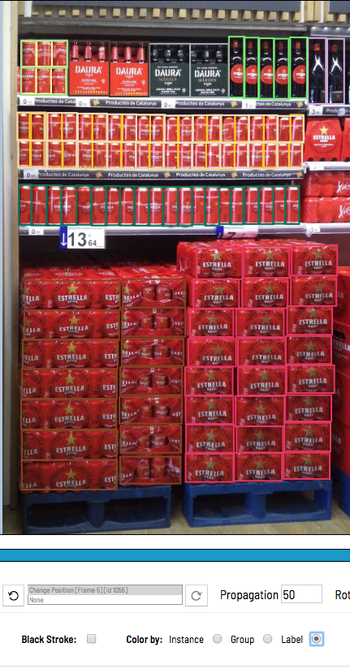
